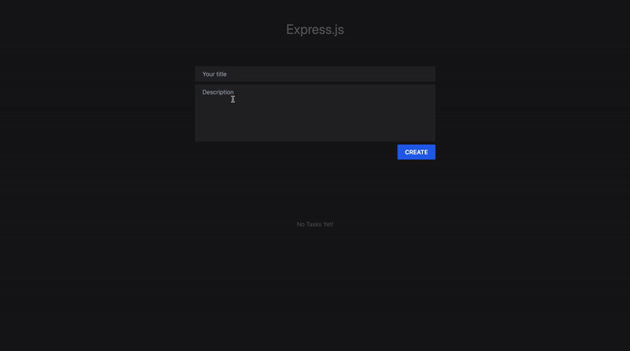

# Tasks
Built with **Express.js**, **EJS** for templating, and **Tailwind CSS**. You create, view, edit, and delete tasks, where each task is stored as a text file on the server.

## Installation

1. **Clone the repository:**

    ```bash
    git clone https://github.com/Shoaib-Imrann/Backend.git
    ```

2. **Go to the project**

    ```bash
    cd backend/WebApp-1
    ```

3. **Start the Server:**

    ```bash
    npx nodemon index.js
    ```

    Open [http://localhost:3000](http://localhost:3000)


    