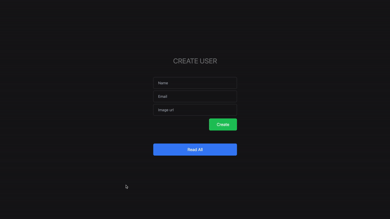

# User Profiles
coded in **Express.js**, **MongoDB** and **Tailwind CSS**.

## To view it in your setup

1. **Clone the repository:**

    ```bash
    git clone https://github.com/Shoaib-Imrann/Backend.git
    ```

2. **Go to the project**

    ```bash
    cd backend/WebApp-2
    ```

3. **Start the Server:**

    ```bash
    npx nodemon index.js
    ```

    Open [http://localhost:3000](http://localhost:3000)


    